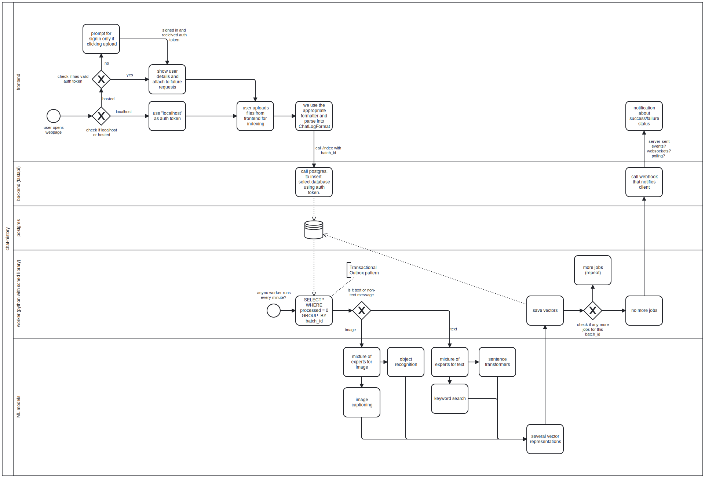

# Chat History Infra

Here, we implement a dockerized version of the chat-history architecture.

The main purpose of having microservices as opposed to the previous vector-database monolith, is to segregate the different functions into containers/serverless functions that can have varying CPU/memory needs.

Another purpose is to ensure that local development is seamless.

## Prerequisites

- `brew install tilt`
- `Docker Desktop`
- `Docker Desktop k8s addon`
- `vector-database` checked out
- other repos (for `worker` and `ml`) to be added later

## Getting started

1. `tilt up`

## Architecture overview

### Container categories
- Backend

  This is a FastAPI server. It is expected have very low requirements, but be 24/7 up.

- Database

  This is a Postgres instance. Not sure what my database requirements are yet.

- Worker

  This is a job scheduler. Its main job is to implement the https://microservices.io/patterns/data/transactional-outbox.html, pull jobs from the database and queue them up in ML container(s).
  It can either be up 24/7 and run its own cronjobs, or as a function that is run by some external cron.

- ML

  This encompasses the various ML jobs that need to be run. It could be something heavily intensive like indexing, or something that needs a speedy response like inference.

### Architecture Diagram

## Technology biases

### Container

Using Docker containers.

### Orchestration

Using k8s as it is widespread, and can be deployed either locally or on cloud.

### Local Container Engine

Using Docker Desktop as I already have it installed.

### Local Development

Using Tilt, as it provides:
- UI out of the box
- Logs
- Least amount of config file tinkering (initial tiltfile is just 3 lines)

Considered devspace but:
- UI out of the box didn't provide enough logs
- Auto-generated devspace config file was too verbose

Considered skaffold but:
- No UI out of the box
- Not enough logs